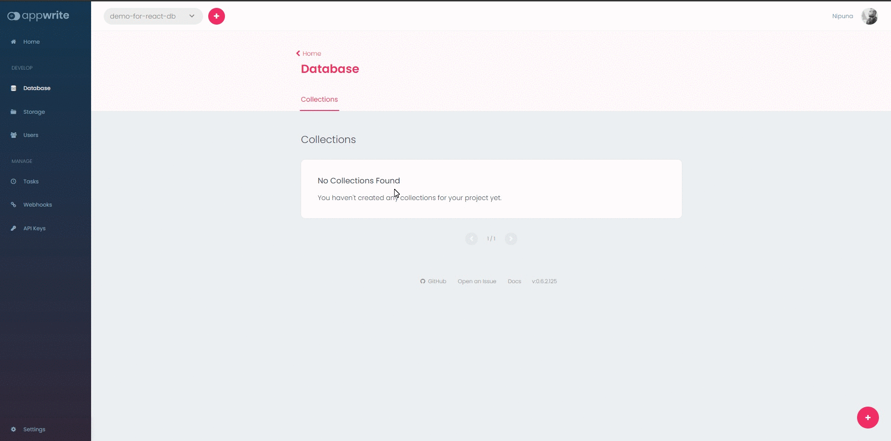
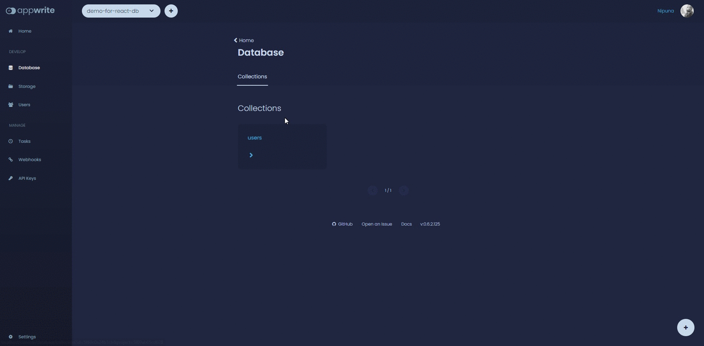
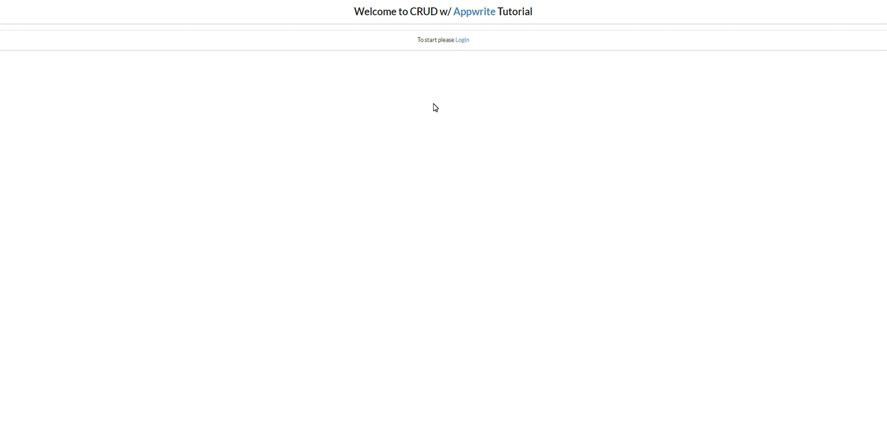
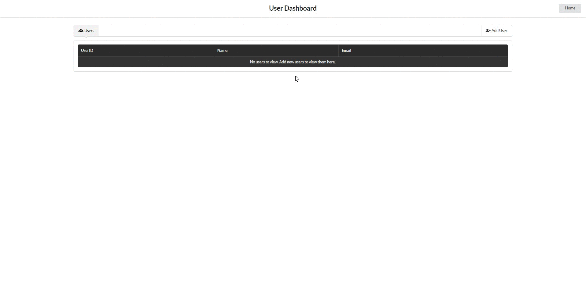
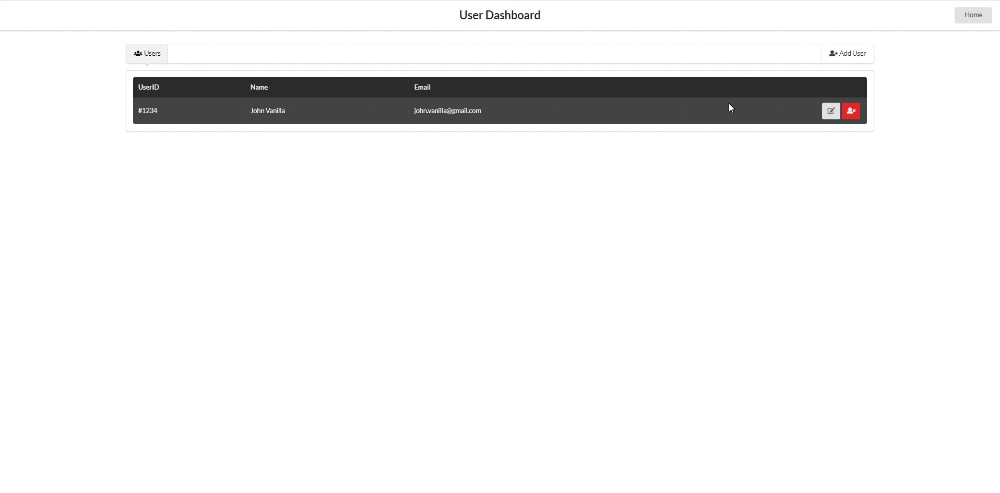
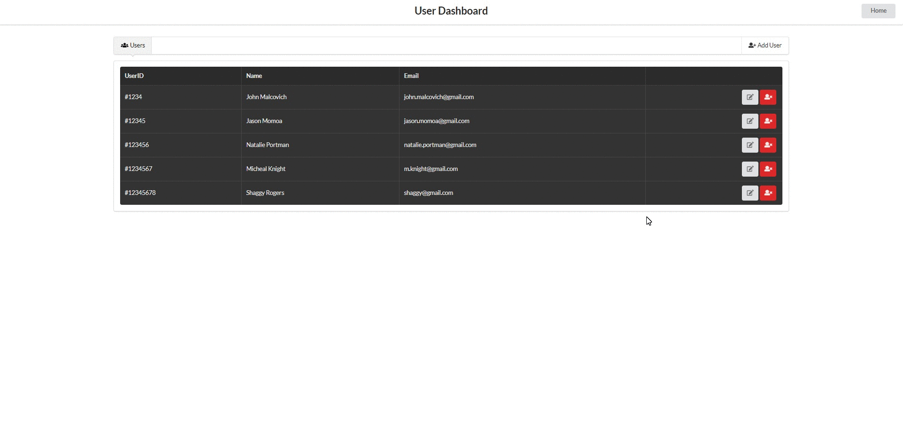

# Appwrite + ReactJS = ❤

This example is to show how to do CRUD (CREATE, READ, UPDATE, DELETE) operations using [Appwrite's JS API](https://github.com/appwrite/sdk-for-js) with [React](https://reactjs.org/).

## Prerequisites

- A Recent Version of [NodeJS](https://nodejs.org/en/)
- [NPM](https://www.npmjs.com/)
- [A locally running Appwrite instance](https://appwrite.io/docs/installation).
- Completed the [example-auth](https://github.com/appwrite/demos-for-react/tree/master/example-auth) tutorial (I assume that you have knowledge in using login endpoint in Appwrite.)

## Getting Started

To get started quickly you can follow the [initial tutorial](https://github.com/appwrite/demos-for-react/tree/master/example-auth).

In this tutorial we are going to use the Appwrite's API to create documents, read, update and delete them.

First you have to create a collection in Appwrite's console. (In the [initial tutorial](https://github.com/appwrite/demos-for-react/tree/master/example-auth), you should have created a project in the Appwrite console.)



Now find the Collection ID and keep it copied since we are going to need it.

## Development

Enough with the theories, now let's move on to the real deal. Let's see how our React application is structured.

1. All the actions will be inside `/src/actions` directory
2. All the components will be inside `/src/components` directory
3. Configuration file is inside `/src/config` directory
4. Helper functions will be inside `/src/helpers` directory

Now Let's create our `/src/App.js` file.

```js
import React from "react";
import Routes from "./routes";
import "semantic-ui-css/semantic.min.css";

const App = () => {
  return <Routes />;
};

export default App;
```

I have used [Semantic UI React](https://react.semantic-ui.com/) as the CSS framework.

Now let's create the `/src/routes.js` file.

```js
import React from "react";
import { BrowserRouter as Router, Route, Switch } from "react-router-dom";
import Home from "./components/Home";
import Login from "./components/Login";
import Users from "./components/Users";

const Routes = () => {
  return (
    <Router>
      <Switch>
        <Route exact path={"/"} render={(props) => <Home {...props} />} />
        <Route exact path={"/users"} render={(props) => <Users {...props} />} />
        <Route exact path={"/login"} render={(props) => <Login {...props} />} />
        <Route exact path={"*"} component={Home} /> //If the route does not matches
        it will return the homepage
      </Switch>
    </Router>
  );
};

export default Routes;
```

Here we only create three routes. One for our homepage, one for the User Dashboard and another one for Login page.

Now let's create the Homepage inside `/src/components/Login/index.js`

```js
import React, { useEffect, useState } from "react";
import { Button, Form, Grid, Message, Segment } from "semantic-ui-react";
import { Link, useHistory } from "react-router-dom";
import { getUserData, login } from "../../actions";
import Spinner from "../../helpers/Spinner";

const Login = () => {
  const history = useHistory();

  const [profile, setProfile] = useState(null);
  const [email, setEmail] = useState("");
  const [password, setPassword] = useState("");
  const [loading, setLoading] = useState(true);
  const [error, setError] = useState(null);

  useEffect(() => {
    //retrieving user profile data from the backend when the Login component is mounted (Similar to the use of componentDidMount())
    getUserData() //this function is declared in '/src/actions/index.js' file
      .then((response) => {
        setProfile(response);
        setLoading(false);
      })
      .catch((e) => {
        console.log(e.message);
        setLoading(false);
        setProfile(false);
      });
  }, []);

  useEffect(() => {
    //redirecting to User Dashboard if the user is already logged in
    if (profile) {
      history.push("/users");
    }
  }, [history, profile]);

  const loginHandler = () => {
    //by providing email and password, the user is logged in and redirected to the User Dashboard
    login(email, password) //this function is declared in '/src/actions/index.js' file
      .then(() => history.push("/users"))
      .catch((err) => {
        setError(err.message);
      });
  };

  //if the user is not logged in and the loading is completed, the login component is shown. Otherwise, a Spinner will be shown.
  if (profile === false && loading === false) {
    return (
      <Grid>
        <Grid.Row columns={1}>
          <Grid.Column>
            <Segment textAlign={"center"}>User Login</Segment>
          </Grid.Column>
        </Grid.Row>
        <Grid.Row style={{ marginTop: "20px" }} columns={3}>
          <Grid.Column />
          <Grid.Column>
            <Segment>
              {error && (
                <Message error>
                  <Message.Header>Error</Message.Header>
                  {error}
                </Message>
              )}
              <Form onSubmit={loginHandler}>
                <Form.Field>
                  <label>Email</label>
                  <input
                    type={"email"}
                    placeholder="Email"
                    onChange={(e) => setEmail(e.target.value)}
                  />
                </Form.Field>
                <Form.Field>
                  <label>Password</label>
                  <input
                    type={"password"}
                    placeholder="Password"
                    onChange={(e) => setPassword(e.target.value)}
                  />
                </Form.Field>
                <Form.Field>
                  <Link to={"/"}>Go to Home</Link>
                </Form.Field>
                <Button type="submit">Login</Button>
              </Form>
            </Segment>
          </Grid.Column>
          <Grid.Column />
        </Grid.Row>
      </Grid>
    );
  } else {
    return <Spinner />;
  }
};

export default Login;
```

What we are doing here is by providing the login credentials creating a new session for the current user. When the user is successfully logged in they will be redirected to the User Dashboard.
If the login is not successful, the user will be notified with an error message. In this Login component, when it is first mounted, the user profile data will be retrieved from the Appwrite backend and if the user is not logged on, the user profile data will be null. Therefore, if the user profile data is null, this login component will be shown. If the user profile data is not null, the user will be redirected the User Dashboard. The related functions for this component is refactored in the actions file `/src/actions/index.js`.

Now let's create the HomePage component, which is really easy.

```js
import React, { useEffect, useState } from "react";
import { Button, Grid, Segment } from "semantic-ui-react";
import { Link, useHistory } from "react-router-dom";
import { getUserData, logout } from "../../actions";
import Spinner from "../../helpers/Spinner";

const Home = () => {
  const history = useHistory();
  const [profile, setProfile] = useState(null);
  const [loading, setLoading] = useState(false);

  useEffect(() => {
    getUserData()
      .then((response) => {
        setProfile(response);
        setLoading(false);
      })
      .catch((e) => {
        console.log(e.message);
        setProfile(false);
        setLoading(false);
      });
  }, []);

  const common = (
    <Segment textAlign={"center"}>
      <h2>
        Welcome to CRUD w/ <a href="https://appwrite.io/">Appwrite</a> Tutorial
      </h2>
    </Segment>
  );

  if (profile && loading === false) {
    console.log(profile);
    return (
      <div>
        {common}
        <Grid>
          <Grid.Row columns={3}>
            <Grid.Column />
            <Grid.Column>
              <Segment>
                <Grid verticalAlign={"middle"}>
                  <Grid.Row columns={2}>
                    <Grid.Column computer={12} textAlign={"left"}>
                      <h3>
                        Go to <Link to={"/users"}>User Dashboard</Link>
                      </h3>
                    </Grid.Column>
                    <Grid.Column computer={4}>
                      <Button
                        floated={"right"}
                        primary
                        onClick={() => logout(history)}
                      >
                        Logout
                      </Button>
                    </Grid.Column>
                  </Grid.Row>
                </Grid>
              </Segment>
            </Grid.Column>
            <Grid.Column />
          </Grid.Row>
        </Grid>
      </div>
    );
  } else if (profile === false && loading === false) {
    return (
      <div>
        {common}
        <Segment textAlign={"center"}>
          To start please <Link to={"/login"}>Login</Link>
        </Segment>
      </div>
    );
  } else {
    return <Spinner />;
  }
};

export default Home;
```

As I mentioned in the Login Component, in here we also check whether the user is already logged in or not. If the user is logged in, the homepage will show a link to the User Dashboard, otherwise it will show a message asking the user to login.

Now let's create the most important part of our CRUD application. Let's create the User Dashboard component. Now create the file `/src/components/User/index.js`.

```js
import React, { useEffect, useState } from "react";
import {
  creatUserDocument,
  deleteUserDocument,
  getUserData,
  getUserDocuments,
  updateUserDocument,
} from "../../actions";
import Spinner from "../../helpers/Spinner";
import { Link, Redirect } from "react-router-dom";
import {
  Table,
  Icon,
  Menu,
  Grid,
  Segment,
  Button,
  Modal,
  Header,
  Form,
  Message,
} from "semantic-ui-react";

const Users = () => {
  const [profile, setProfile] = useState(null);
  const [visibleAddModal, setVisibleAddModal] = useState(false);
  const [visibleUpdateModal, setVisibleUpdateModal] = useState(false);
  const [visibleDeleteModal, setVisibleDeleteModal] = useState(false);
  const [loading, setLoading] = useState(false);
  const [userID, setUserID] = useState("");
  const [name, setName] = useState("");
  const [email, setEmail] = useState("");
  const [usersList, setUsersList] = useState([]);
  const [error, setError] = useState(null);

  useEffect(() => {
    getUserData()
      .then((response) => {
        setProfile(response);
        getUserDocuments().then(({ documents }) => setUsersList(documents)); //the action for getting all the user documents from the database
      })
      .catch(() => setProfile(false));
  }, []);

  const handleAddUser = () => {
    setLoading(true);
    creatUserDocument({ userID, name, email }) //the action for creating the user
      .then(() => {
        getUserDocuments().then(({ documents }) => setUsersList(documents));
        setLoading(false);
        setVisibleAddModal(false);
      })
      .catch((e) => {
        setLoading(false);
        setError(e.message);
      });
  };

  const handleUpdateUser = (documentID) => {
    setLoading(true);
    updateUserDocument({ documentID, name, email }) //the action for updating the user
      .then(() => {
        getUserDocuments().then(({ documents }) => setUsersList(documents));
        setLoading(false);
        setVisibleUpdateModal(false);
      })
      .catch((e) => {
        setLoading(false);
        setError(e.message);
      });
  };

  const handleDeleteUser = (documentID) => {
    setLoading(true);
    deleteUserDocument(documentID) //the action for deleting a specific user
      .then(() => {
        getUserDocuments().then(({ documents }) => setUsersList(documents));
        setLoading(false);
        setVisibleDeleteModal(false);
      })
      .catch((e) => {
        setLoading(false);
        setError(e.message);
      });
  };

  if (profile) {
    return (
      <Grid>
        <Grid.Row>
          <Grid.Column>
            <Segment textAlign={"center"}>
              <Grid>
                <Grid.Row columns={3} verticalAlign={"middle"}>
                  <Grid.Column />
                  <Grid.Column>
                    <h2>User Dashboard</h2>
                  </Grid.Column>
                  <Grid.Column textAlign={"right"}>
                    <Link to={"/"}>
                      <Button>Home</Button>
                    </Link>
                  </Grid.Column>
                </Grid.Row>
              </Grid>
            </Segment>
          </Grid.Column>
        </Grid.Row>
        <Grid.Row columns={3}>
          <Grid.Column computer={2} />
          <Grid.Column computer={12}>
            <Menu pointing>
              <Menu.Item
                icon={<Icon name="users" />}
                name="users"
                active={true}
              />
              <Menu.Menu position="right">
                {/*modal for adding a new user to the database*/}
                <Modal
                  closeOnDimmerClick={false}
                  closeIcon
                  onClose={() => {
                    setVisibleAddModal(false);
                    setUserID("");
                    setName("");
                    setEmail("");
                    setError(null);
                  }}
                  onOpen={() => setVisibleAddModal(true)}
                  open={visibleAddModal}
                  size="small"
                  trigger={
                    <Menu.Item
                      icon={<Icon name="add user" />}
                      name="add-user"
                    />
                  }
                >
                  <Header icon>
                    <Icon name="add user" />
                    Add User
                  </Header>
                  <Modal.Content>
                    {error && (
                      <Message error>
                        <Message.Header>Error</Message.Header>
                        {error}
                      </Message>
                    )}
                    <Form onSubmit={handleAddUser}>
                      <Form.Field>
                        <label>UserID</label>
                        <input
                          type={"text"}
                          value={userID}
                          onChange={(e) => setUserID(e.target.value)}
                          placeholder="UserID"
                        />
                      </Form.Field>
                      <Form.Field>
                        <label>Name</label>
                        <input
                          type={"text"}
                          value={name}
                          onChange={(e) => setName(e.target.value)}
                          placeholder="Name"
                        />
                      </Form.Field>
                      <Form.Field>
                        <label>Email</label>
                        <input
                          type={"email"}
                          value={email}
                          onChange={(e) => setEmail(e.target.value)}
                          placeholder="Email"
                        />
                      </Form.Field>
                      <Button
                        color={"green"}
                        loading={loading}
                        inverted
                        type="submit"
                      >
                        Submit
                      </Button>
                    </Form>
                  </Modal.Content>
                </Modal>
              </Menu.Menu>
            </Menu>

            <Segment>
              <Table celled inverted selectable>
                <Table.Header>
                  <Table.Row>
                    <Table.HeaderCell>UserID</Table.HeaderCell>
                    <Table.HeaderCell>Name</Table.HeaderCell>
                    <Table.HeaderCell>Email</Table.HeaderCell>
                    <Table.HeaderCell />
                  </Table.Row>
                </Table.Header>

                <Table.Body>
                  {usersList.map((user, i) => (
                    <Table.Row key={i}>
                      <Table.Cell>{user.userID}</Table.Cell>
                      <Table.Cell>{user.name}</Table.Cell>
                      <Table.Cell>{user.email}</Table.Cell>
                      <Table.Cell textAlign={"right"}>
                        {/*modal for updating the user data*/}
                        <Modal
                          closeOnDimmerClick={false}
                          closeIcon
                          onClose={() => {
                            setVisibleUpdateModal(false);
                            setName("");
                            setEmail("");
                            setError(null);
                          }}
                          onOpen={() => {
                            setVisibleUpdateModal(true);
                            setName(user.name);
                            setEmail(user.email);
                          }}
                          open={visibleUpdateModal}
                          size="small"
                          trigger={<Button icon={<Icon name={"edit"} />} />}
                        >
                          <Header icon>
                            <Icon name="user" />
                            Update User: {user.name}
                          </Header>
                          <Modal.Content>
                            {error && (
                              <Message error>
                                <Message.Header>Error</Message.Header>
                                {error}
                              </Message>
                            )}
                            <Form onSubmit={() => handleUpdateUser(user.$id)}>
                              <Form.Field>
                                <label>UserID</label>
                                <input
                                  type={"text"}
                                  defaultValue={user.userID}
                                  placeholder="UserID"
                                />
                              </Form.Field>
                              <Form.Field>
                                <label>Name</label>
                                <input
                                  type={"text"}
                                  value={name}
                                  onChange={(e) => setName(e.target.value)}
                                  placeholder="Name"
                                />
                              </Form.Field>
                              <Form.Field>
                                <label>Email</label>
                                <input
                                  type={"email"}
                                  value={email}
                                  onChange={(e) => setEmail(e.target.value)}
                                  placeholder="Email"
                                />
                              </Form.Field>
                              <Button
                                color={"green"}
                                loading={loading}
                                inverted
                                type="submit"
                              >
                                Update
                              </Button>
                            </Form>
                          </Modal.Content>
                        </Modal>
                        {/*modal for deleting a user from the database*/}
                        <Modal
                          closeOnDimmerClick={false}
                          closeIcon
                          dimmer={"inverted"}
                          onClose={() => {
                            setVisibleDeleteModal(false);
                            setError(null);
                          }}
                          onOpen={() => setVisibleDeleteModal(true)}
                          open={visibleDeleteModal}
                          size="small"
                          trigger={
                            <Button
                              color={"red"}
                              icon={<Icon name={"user delete"} />}
                            />
                          }
                        >
                          <Header icon>
                            <Icon name="user delete" />
                            Delete User: {user.name}
                          </Header>
                          <Modal.Content>
                            {error && (
                              <Message error>
                                <Message.Header>Error</Message.Header>
                                {error}
                              </Message>
                            )}
                            <Form onSubmit={() => handleDeleteUser(user.$id)}>
                              <Form.Field>
                                Are you sure to delete this user?
                              </Form.Field>
                              <Button
                                color={"red"}
                                loading={loading}
                                inverted
                                type="submit"
                              >
                                Delete
                              </Button>
                            </Form>
                          </Modal.Content>
                        </Modal>
                      </Table.Cell>
                    </Table.Row>
                  ))}
                  {usersList.length === 0 && (
                    <Table.Row>
                      <Table.Cell colSpan={4} textAlign={"center"}>
                        No users to view. Add new users to view them here.
                      </Table.Cell>
                    </Table.Row>
                  )}
                </Table.Body>
              </Table>
            </Segment>
          </Grid.Column>
          <Grid.Column computer={2} />
        </Grid.Row>
      </Grid>
    );
  } else if (profile === false) {
    return <Redirect to={"/login"} />;
  } else {
    return <Spinner />;
  }
};

export default Users;
```

What we are doing here is that we are getting the user data from the backend and list them inside a table. If the user wants to add a record to the database, they can click on the "Add User" button, and a modal will be opened. Inside the modal the user can add the details and create a record. Also, if the user wants to edit a record, they can do that by clicking on the relevant edit button and if the user wants to delete a record, they can do that by clicking the relevant delete button.

Now let's see how the Appwrite SDK is used to do this awesome CRUD tasks. Let's create `/src/actions/index.js` file.

```js
import { Account, Databases, ID } from "appwrite";
import { client, collectionID, databaseID } from "../config";

const account = new Account(client);
const database = new Databases(client);

const getUserData = async () => {
  try {
    return account.get();
  } catch (e) {
    console.error(e.message);
  }
};

const login = async (email, password) => {
  try {
    return account.createEmailSession(email, password);
  } catch (e) {
    console.error(e.message);
  }
};

const logout = async (history) => {
  try {
    await account.deleteSession("current");
    return history.push("/login");
  } catch (e) {
    console.error(e.message);
  }
};

const creatUserDocument = async (userData) => {
  try {
    return database.createDocument(
      databaseID,
      collectionID,
      ID.unique(),
      userData
    );
  } catch (e) {
    console.error(e.message);
  }
};

const getUserDocuments = async () => {
  try {
    return database.listDocuments(databaseID, collectionID);
  } catch (e) {
    console.error(e.message);
  }
};

const updateUserDocument = async ({ documentID, name, email }) => {
  try {
    return database.updateDocument(databaseID, collectionID, documentID, {
      name,
      email,
    });
  } catch (e) {
    console.error(e.message);
  }
};

const deleteUserDocument = async (documentID) => {
  try {
    return database.deleteDocument(databaseID, collectionID, documentID);
  } catch (e) {
    console.error(e.message);
  }
};

export {
  getUserData,
  login,
  logout,
  creatUserDocument,
  getUserDocuments,
  updateUserDocument,
  deleteUserDocument,
};
```

In here we are creating the necessary actions to do the CRUD operations. First let's create function to add a record to the database. However, before this we need to add some database collection rules to the collection that we have created in the beginning of the tutorial.

#### Rules and permissions in Appwrite

This is the most important part in creating and managing documents in Appwrite. When we are creating a Collection in Appwrite the default permission to read and write is null. It means until we provide specific permissions, we cannot do any CRUD operations. The two basic categories of permissions are as follows.

`Read` - Read (Listing documents) permission for the documents in the collection

`Write` - Write (Create, Update, and Delete documents) permission for the documents in the collection

Under this two basic permission categories, Appwrite has defined a set of permissions. For our application I have selected the `Wildcard` permission which means it gives public access for read and write to the collection. The following are the permissions types for `Read` and `Write`.

| Type                      | Description                                                   |
| ------------------------- | ------------------------------------------------------------- |
| \*                        | Wildcard permission (public read or write access)             |
| user:\[USER_ID\]          | Access to a specific user by their user-ID.                   |
| team:\[TEAM_ID\]          | Access to any member of the specific team.                    |
| team:\[TEAM_ID\]/\[ROLE\] | Access to any member who possesses a specific role in a team. |
| member:\[MEMBER_ID\]      | Access to a specific member of a team.                        |

For more information about `Teams` and `Roles` please follow the [Teams](https://appwrite.io/docs/client/teams) documentation. The above table is an excerpt of the main documentation, and for more information, follow the comprehensive documentation of [Appwrite Permissions](https://appwrite.io/docs/permissions).

Now let's add read and write permissions for our collection.

For the `Users` collection, I have set the read and write permissions as `Wildcard` which means anyone can read and write to the collection. However, remember, in a production application, this is a bad practice. Always protect your collections like cash 😁.



Now remember, we have only set read and write permissions to the `Users` collection. We have to add rules for our collection as well. Rules in a collection are used to structure the data in a document. With specifying the rules we can validate the input before saving it in the database. Recall `MongoDB Document Schemas`, and Appwrite document rules are somewhat similar.

In my `Users` collection, the document structure is as follows.

```json
{
  "userID": "#123",
  "name": "John",
  "email": "john@gmail.com"
}
```

In each field, I have to specify the `label`, `key`,`type`,`required` from Appwrite console. The following is an excerpt from the [main documentation](https://appwrite.io/docs/rules).

| Name     | Required | Type    | Description                                                                                                                         |
| -------- | -------- | ------- | ----------------------------------------------------------------------------------------------------------------------------------- |
| label    | yes      | string  | Rule display name.                                                                                                                  |
| key      | yes      | string  | Rule name. No special characters and no spaces. Max 32 chars.                                                                       |
| type     | yes      | string  | [Rule key type](https://appwrite.io/docs/rules#types). <br> \["text","numeric","boolean","wildcard","url","email","ip","document"\] |
| default  | yes      | any     | Default value for this rule type.                                                                                                   |
| required | yes      | boolean | Decide if this rule value is required in order to pass document validation.                                                         |

For our `User` collection, I have selected the following rule type for each field.

```json
{
  "userID": {
    "label": "User-ID",
    "key": "userID",
    "type": "text",
    "required": true
  },
  "name": {
    "label": "Name",
    "key": "name",
    "type": "text",
    "required": true
  },
  "email": {
    "label": "Email",
    "key": "email",
    "type": "email",
    "required": true
  }
}
```

Now let's add these rules to our collection from the Appwrite console.


Since we have moved the heavy stuff, let's move on to creating the functions to implement the CRUD operations.

#### Create a record

To create a record we have to use the Appwrite's Create Document API endpoint. The SDK provides a function for this. Let's implement it.

```js
const creatUserDocument = async (userData) => {
  try {
    return database.createDocument(
      databaseID, //database-id where the record is stored
      collectionID, //collection-id where the record is stored
      ID.unique(), //A unique ID need to pass
      userData //the record itself
    );
  } catch (e) {
    console.error(e.message);
  }
};
```

In this `database.createDocument` function we have to provide four required parameters.

1. CollectionID
2. CollectionID
3. Unique string
4. The data of the record (A JSON object containing all the record data)

The user that create this document can only delete.

For more information about Create Document function, you can refer to the [main documentation](https://appwrite.io/docs/client/database?sdk=web#createDocument). When we are creating a document, the database will automatically create a `documentID` for the record. This `documentID` is needed when updating or deleting a document.

After Create Document function is called, upon success, the response will be this.

```json
{
  "userID": "433",
  "name": "Omji Kushwaha",
  "email": "omjikush09@gmail.com",
  "$id": "6341c3f2b99f6303fae5",
  "$permissions": [
    "read(\"user:6341c2092738b132eb80\")",
    "update(\"user:6341c2092738b132eb80\")",
    "delete(\"user:6341c2092738b132eb80\")"
  ],
  "$createdAt": "2022-10-08T18:39:46.761+00:00",
  "$updatedAt": "2022-10-08T18:39:46.761+00:00",
  "$collectionId": "633ae0beae855eba99c9",
  "$databaseId": "633ae03c9d2692732dbb"
}
```

#### Read (list) the records

Since we have created a record, we can list the records from the database. To do this let's implement List Documents function.

```js
const getUserDocuments = async () => {
  try {
    return database.listDocuments(databaseID, collectionID);
  } catch (e) {
    console.error(e.message);
  }
};
```

This function is pretty straightforward, we have to provide the `collectionID` and `databaseId` . For more information about listing documents you can go through the [documentation](https://appwrite.io/docs/client/database?sdk=web#listDocuments).

The response of List Documents function is as follows.

```json
{
  "total": 2,
  "documents": [
    {
      "userID": "1224",
      "name": "Omji Kushwaha",
      "email": "omjicompaq6@gmail.com",
      "$id": "6341c3d69b24b0ddb662",
      "$createdAt": "2022-10-08T18:39:18.636+00:00",
      "$updatedAt": "2022-10-08T18:39:18.636+00:00",
      "$permissions": [
        "read(\"user:6341c2092738b132eb80\")",
        "update(\"user:6341c2092738b132eb80\")",
        "delete(\"user:6341c2092738b132eb80\")"
      ],
      "$collectionId": "633ae0beae855eba99c9",
      "$databaseId": "633ae03c9d2692732dbb"
    },
    {
      "userID": "433",
      "name": "Omji Kushwaha",
      "email": "omjikush09@gmail.com",
      "$id": "6341c3f2b99f6303fae5",
      "$createdAt": "2022-10-08T18:39:46.761+00:00",
      "$updatedAt": "2022-10-08T18:39:46.761+00:00",
      "$permissions": [
        "read(\"user:6341c2092738b132eb80\")",
        "update(\"user:6341c2092738b132eb80\")",
        "delete(\"user:6341c2092738b132eb80\")"
      ],
      "$collectionId": "633ae0beae855eba99c9",
      "$databaseId": "633ae03c9d2692732dbb"
    }
  ]
}
```

All the documents are listed under the `documents` field. Each object inside `documents` array represents a record in the `Users` collection. .

#### Update a record

We can update a specific record using Update Document function.

```js
const updateUserDocument = async ({ documentID, name, email }) => {
  try {
    return database.updateDocument(
      databaseID, //the database-id
      collectionID, //the collection-id
      documentID, //the document-id of the record that we are updating
      { name, email } //fields and data that needs to be updated in the record
    );
  } catch (e) {
    console.error(e.message);
  }
};
```

In this `database.updateDocument` function we have to provide five required parameters.

1. DatabaseID
2. CollectionID
3. DocumentID
4. The data of the record to be updated (A JSON object containing all the record data to be updated)

For more information, you can refer the [documentation](https://appwrite.io/docs/client/database?sdk=web#updateDocument).

The response from Update Document function is as follows. It is similar to the response from Create Document function.

```json
{
  "userID": "433",
  "name": "Rohjt",
  "email": "omjicompaq6@gmail.com",
  "$id": "6341c3f2b99f6303fae5",
  "$createdAt": "2022-10-08T18:39:46.761+00:00",
  "$updatedAt": "2022-10-08T18:46:24.538+00:00",
  "$permissions": [
    "read(\"user:6341c2092738b132eb80\")",
    "update(\"user:6341c2092738b132eb80\")",
    "delete(\"user:6341c2092738b132eb80\")"
  ],
  "$collectionId": "633ae0beae855eba99c9",
  "$databaseId": "633ae03c9d2692732dbb"
}
```

#### Delete a record

Finally, we have come to the end of the line. We can now delete a record. To do this let's implement Delete Document function.

```js
const deleteUserDocument = async (documentID) => {
  try {
    return database.deleteDocument(databaseID, collectionID, documentID);
  } catch (e) {
    console.error(e.message);
  }
};
```

This function is also pretty straightforward. We only have to provide the`databaseID`, `collectionID` and the `documentID`. For more information, you can refer the [documentation](https://appwrite.io/docs/client/database?sdk=web#deleteDocument).

The response from successful deletion of a record is only the `HTTP 204` message, and it does not provide any `JSON` response.

Now we have completed all our CRUD operations. Now let's see how our application works.

### Login



### Create and view records



### Update a record



### Delete a record



## What's next?

Congratulations! You've just created a full featured CRUD application using Appwrite.

If you have noticed, I too have left out the registering a user feature. You can use your imagination and build something wonderful with the resources Appwrite has provided! 😇

Good Luck on your future developments using Appwrite! If you need any help feel free to join the [Discord](https://discord.gg/ZFwqr3S) or refer to the [Appwrite Documentation](https://appwrite.io/docs). TIP: [Checkout account create documentation for the web API](https://appwrite.io/docs/client/account#create)

(Checkout the complete code of this tutorial from the [repository](https://github.com/appwrite/demos-for-react/tree/master/example-crud))
