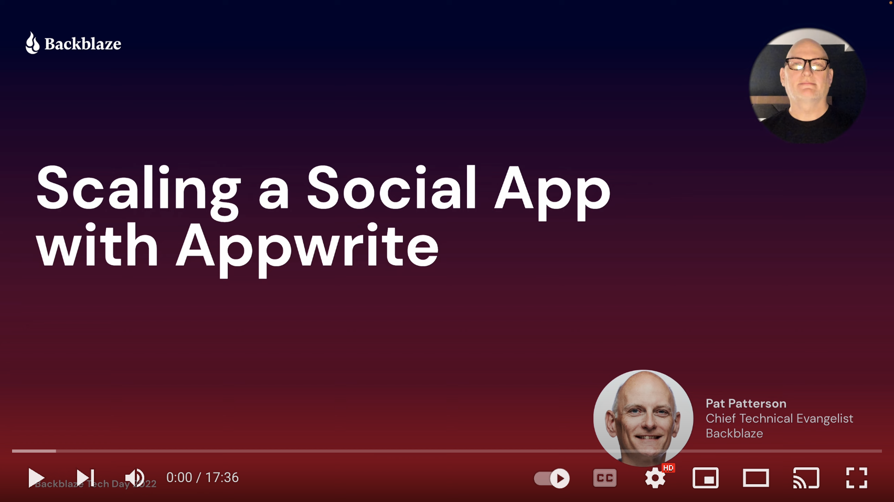

# 🖼️ Images With React

A simple image sharing app built with Appwrite and React, demonstrating [Appwrite Storage](https://appwrite.io/docs/storage) and [Permissions](https://appwrite.io/docs/permissions).


Adapted from [Todo With React](https://github.com/appwrite/demo-todo-with-react).

## 🎬 Getting Started

### 🤘 Install Appwrite 
Follow our simple [Installation Guide](https://appwrite.io/docs/installation) to get Appwrite up and running in no time. You can either deploy Appwrite on your local machine or, on any cloud provider of your choice. 

> Note: If you setup Appwrite on your local machine, you will need to create a public IP so that your hosted frontend can access it.
  
We need to make a few configuration changes to your Appwrite server. 

1. (Optional) Configure a Storage in Appwrite

    Although you can deploy the app with the default Local storage, this app is intended to allow you to experiment with other Appwrite Storage adapters. For example, you could [configure Backblaze B2 Cloud Storage to store files in the cloud](https://dev.to/appwrite/appwrite-storage-meets-backblaze-b2-4m2e).
    
    If you do configure a Storage, remember to restart Appwrite after editing your `.env` file. This can be easily done by running the following command.
    
    ```bash
    docker-compose up -d
    ```

2. Create a new project in the Appwrite console.

3. Add a new Web App to the project and enter your website's endpoint (`localhost, <project-name>.vercel.app etc`)

    
    
4. Click **Storage** in the left navigation menu to create a new bucket.
  * Give the bucket a suitable name, for example, `user-images`, and click **Create**.
  * Make a note of the **Bucket ID** on the right of the Settings page.
  * Scroll down the Settings page, and click **Add Role**. 
  * In the **Role** dropdown, select `users`, and enable the **Create** permission.
  * Enable **File Security**.
  * Click **Update** to update the bucket's settings.

    

## 🚀 Deploy the Front End

You have two options to deploy the front-end and we will cover both of them here. In either case, you will need to fill in these environment variables that help your frontend connect to Appwrite.

* `REACT_APP_ENDPOINT` - Your Appwrite endpoint
* `REACT_APP_PROJECT` - Your Appwrite project ID
* `REACT_APP_BUCKET_ID` - The Appwrite bucket ID you noted in the previous step

### **Deploy to a Static Hosting Provider**

Use the following buttons to deploy to your favourite hosting provider in one click! We support Vercel, Netlify and DigitalOcean. You will need to enter the environment variables above when prompted.

[](https://vercel.com/new/git/external?repository-url=https%3A%2F%2Fgithub.com%2Fmetadaddy%2Fdemo-images-with-react&env=REACT_APP_BUCKET_ID,REACT_APP_PROJECT,REACT_APP_ENDPOINT&envDescription=Your%20Appwrite%20Endpoint%2C%20Project%20ID%20and%20Bucket%20ID%20)

[](https://heroku.com/deploy?template=https://github.com/metadaddy/demo-images-with-react)

[](https://app.netlify.com/start/deploy?repository=https://github.com/metadaddy/demo-images-with-react)

[](https://cloud.digitalocean.com/apps/new?repo=https://github.com/metadaddy/demo-images-with-react/tree/main)

### **Run Locally**

Follow these instructions to run the demo app locally

```sh
$ git clone https://github.com/metadaddy/demo-images-with-react
$ cd demo-images-with-react
```

Run the following command to generate your `.env` vars

```sh
$ cp .env.example .env
```

Now fill in the environment variables we discussed above in your `.env`

Now run the following commands and you should be good to go 💪🏼

```
$ npm install
$ npm start
```

## 👍 Try it Out!

Navigate to the app in your browser. If you deployed the app locally, `npm start` likely opened a browser window for you. If not, navigate to the default URL, `http://localhost:3000/`. Click **Get Started**, **Sign Up**, then enter your name, email, and a password to use with the app.

Click **Select Image for Upload**, select an image from your local drive, then click **Upload**. You will see the image under 'Your Private Images'.

In the Appwrite console, go to your bucket and click the **Files** tab; you will see your file listed there. Click the filename, and you will see that the file has read, update and delete permissions for your user.


Back in the app, click the 🔓 icon to make the image public. The preview will move to the 'Public Images' section.

Back in the Appwrite console, refresh the page in the browser and click the filename again. You will see that the file has gained the read permission for anyone - it is now publicly readable.


In the app, upload a second image, leaving it in the private section, then logout, sign up as a new user, and you will see the first user's public image, but not their private image.

## 🎓 Learn More

This session recording from Backblaze Tech Day '22 explains [Appwrite Storage](https://appwrite.io/docs/storage), [Permissions](https://appwrite.io/docs/permissions) and how this app works.

[](https://www.youtube.com/watch?v=Ij2gI7ZK5YA "Scaling a Social App with Appwrite")

## 🤕 Support

If you get stuck anywhere, file an issue and I'll take a look 🤝
